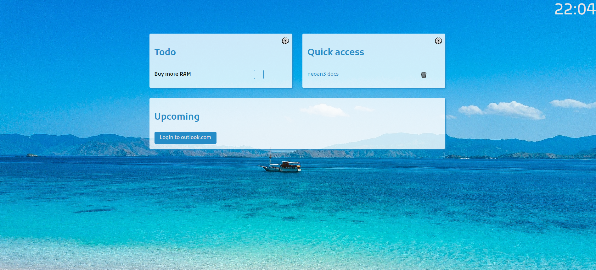

# startpage

Dead simple startpage project 

**Try it out:**

- todos
- bookmarks
- calendar

built on [neoan3](http://neoan3.rocks/getting-started/) 

## Requirements

- PHP ^7.4 
- composer
- yarn or npm

## Installation

_via git clone_

`git clone https://github.com/sroehrl/startpage.git`

_via download_

[download](https://github.com/sroehrl/startpage/archive/master.zip)

(You might have to adjust the .htaccess file depending on your system)

## Test/Develop

`composer global require neoan3/neoan3`

`neoan3 develop` or `neoan3 test`

## Deploy

Package can be deployed as-is. The only modification required is the RewriteBase in ".htaccess"
and changing the Azure client ID to your app. ("component/home/home.ctrl.js")
## License

MIT license [opensource](https://opensource.org/licenses/MIT)

Copyright 2020 [neoan](http://neoan.us) (Stefan Roehrl) 

Permission is hereby granted, free of charge, to any person obtaining a copy of this software and associated documentation files (the "Software"), to deal in the Software without restriction, including without limitation the rights to use, copy, modify, merge, publish, distribute, sublicense, and/or sell copies of the Software, and to permit persons to whom the Software is furnished to do so, subject to the following conditions:

The above copyright notice and this permission notice shall be included in all copies or substantial portions of the Software.

THE SOFTWARE IS PROVIDED "AS IS", WITHOUT WARRANTY OF ANY KIND, EXPRESS OR IMPLIED, INCLUDING BUT NOT LIMITED TO THE WARRANTIES OF MERCHANTABILITY, FITNESS FOR A PARTICULAR PURPOSE AND NONINFRINGEMENT. IN NO EVENT SHALL THE AUTHORS OR COPYRIGHT HOLDERS BE LIABLE FOR ANY CLAIM, DAMAGES OR OTHER LIABILITY, WHETHER IN AN ACTION OF CONTRACT, TORT OR OTHERWISE, ARISING FROM, OUT OF OR IN CONNECTION WITH THE SOFTWARE OR THE USE OR OTHER DEALINGS IN THE SOFTWARE.

